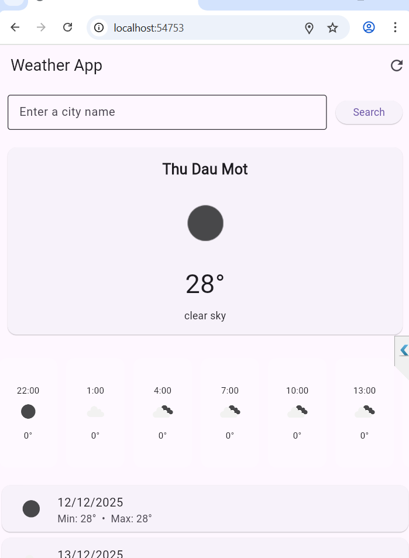

Dưới đây là **README.md hoàn chỉnh**, chuyên nghiệp, phù hợp cho GitHub hoặc báo cáo môn học.
Bạn chỉ cần **copy toàn bộ** và dán vào file `README.md` trong project.

---

# 🌤️ Weather App — Flutter

Ứng dụng Weather App được xây dựng bằng **Flutter**, sử dụng API của **OpenWeatherMap** để hiển thị:

* Thời tiết hiện tại (Current Weather)
* Nhiệt độ, độ ẩm, tốc độ gió, áp suất
* Dự báo theo giờ (Hourly Forecast)
* Dự báo theo ngày (Daily Forecast)
* Tìm kiếm thời tiết theo **tên thành phố**
* Lấy thời tiết theo **tọa độ GPS**

Ứng dụng chạy được trên:

* **Mobile (Android / iOS)**
* **Web (Flutter Web)**

---

## 🚀 Công nghệ sử dụng

| Công nghệ          | Mục đích                |
| ------------------ | ----------------------- |
| Flutter 3.x        | Xây dựng UI đa nền tảng |
| Provider           | State management        |
| HTTP package       | Gọi API REST            |
| OpenWeatherMap API | Lấy dữ liệu thời tiết   |
| Dart               | Ngôn ngữ lập trình      |

---

## 📁 Cấu trúc thư mục

```
lib/
 ├─ config/
 │    └─ api_config.dart          // API key và base URL
 │
 ├─ models/
 │    ├─ weather_model.dart       // Model tổng hợp dữ liệu
 │    ├─ hourly_forecast.dart     // Model dự báo theo giờ
 │    └─ daily_forecast.dart      // Model dự báo theo ngày
 │
 ├─ providers/
 │    ├─ weather_provider.dart    // State quản lý dữ liệu thời tiết
 │    └─ location_provider.dart   // State lấy vị trí GPS
 │
 ├─ services/
 │    ├─ weather_service.dart     // Gọi API /weather & /forecast
 │    └─ location_service.dart    // Lấy tọa độ thiết bị
 │
 ├─ widgets/
 │    ├─ current_weather_card.dart
 │    ├─ hourly_forecast_list.dart
 │    ├─ daily_forecast_card.dart
 │    └─ loading_shimmer.dart
 │
 ├─ screens/
 │    ├─ home_screen.dart         // Màn hình chính
 │    ├─ search_screen.dart       // Tìm kiếm theo tên thành phố
 │    ├─ forecast_screen.dart
 │    └─ settings_screen.dart
 │
 └─ main.dart                     // Khởi động ứng dụng
```

---

## 🔑 Cấu hình API

Ứng dụng sử dụng OpenWeatherMap API (FREE TIER).

Mở file:

```
lib/config/api_config.dart
```

Thay `YOUR_API_KEY` bằng API key thật của bạn:

```dart
class ApiConfig {
  static const String apiKey = "YOUR_API_KEY";
  static const String baseUrl = "https://api.openweathermap.org/data/2.5";
}
```

Lưu ý: API miễn phí có giới hạn, không dùng được OneCall 3.0 → app sử dụng `/weather` và `/forecast` (5-day / 3-hour).

---

## ▶️ Chạy ứng dụng

### **1. Cài đặt package**

```
flutter pub get
```

### **2. Chạy trên Android/iOS**

```
flutter run
```

### **3. Chạy trên Web**

```
flutter run -d chrome
```

Nếu Chrome báo lỗi sandbox, dùng:

```
flutter run -d chrome --web-browser-flag "--no-sandbox"
```

---

## 🧠 Cách hoạt động

### 1. Khi người dùng nhập tên thành phố:

* Provider gọi `WeatherService.getWeather(city)`
* Gọi:

    * `/weather` → lấy dữ liệu hiện tại
    * `/forecast` → lấy danh sách dự báo 5 ngày / mỗi 3 giờ
* Dữ liệu được gộp lại và đưa vào WeatherModel

### 2. Khi lấy vị trí GPS:

* `LocationService` gọi Geolocator để lấy lat/lon
* Gửi request `/weather?lat=&lon=` và `/forecast?lat=&lon=`

---

## 🎨 Giao diện (UI Overview)

* Giao diện nhẹ nhàng, màu pastel
* Card hiển thị:

    * Biểu tượng thời tiết
    * Nhiệt độ
    * Tên khu vực
* Phần dự báo theo giờ:

    * Icon
    * Giờ
    * Nhiệt độ
* Dự báo theo ngày:

    * Min / Max Temp
    * Icon

---


## Màn hình giao diện

